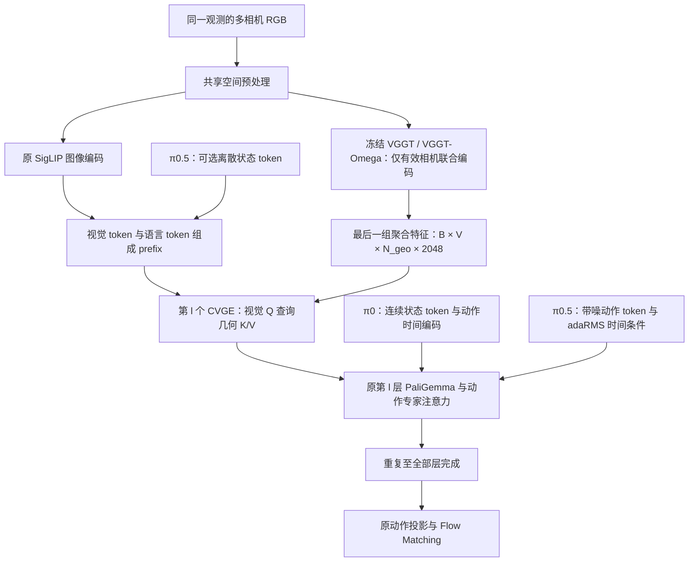

# π0 / π0.5 + VGGDrive 逐层 CVGE 几何注入

本实现把 VGGDrive 的 CVGE（Cross-View Geometric Enabler）接入 OpenPI 的 **PyTorch π0 和 π0.5**：冻结 VGGT 或 VGGT-Omega，提取多视角几何特征；PaliGemma 每层的视觉 token 通过独立 Cross-Attention 查询这些特征；动作仍由对应模型原有的动作专家与 Flow Matching 生成。π0.5 保留离散状态输入选项和 adaRMS 时间条件。

当前状态：π0／π0.5 × VGGT／VGGT-Omega 四种组合的代码和服务器测试用例已编写。本地仅进行静态检查，尚未运行模型、单元测试、GPU 训练或任务评测；运行验证留待服务器准备好后进行。本文命令用于后续服务器验证。

## 1. 架构与迁移范围



“逐层视觉 token”指进入 PaliGemma 后的视觉隐藏状态。默认 `gemma_2b` 和 `gemma_300m` 均为 18 层，对应 **18 个独立 CVGE**。SigLIP 的内部 Transformer 层不增加 CVGE。

每层沿用 VGGDrive 的双侧 MLP、Cross-Attention 内部残差与 LayerNorm、输出 MLP 和外部残差：

```text
q_l = vision_mlp_l(visual_hidden_l)
g_l = geometry_mlp_l(vggt_features)
f_l = LayerNorm(q_l + MultiHeadCrossAttention_l(q_l, g_l, g_l))
enhanced_visual_l = visual_hidden_l + output_mlp_l(f_l)
```

融合空间默认 512 维、8 个头，attention dropout 为 0.1。输出 MLP 最后一层权重和偏置初始化为零，使初始几何残差为零。第一个反向传播步骤首先更新末端投影；该投影离开零值后，梯度再传入 CVGE 的内部投影和注意力。

VGGT 一次输出的最后一组几何特征由全部 CVGE 复用，各层投影和注意力参数独立。保留 VGGT 的 camera、register、patch token；不会强制将几何 token 重采样到 SigLIP token 数量。每个有效视觉 query 可以访问全部有效几何视角。

### 几何后端：VGGT 与 VGGT-Omega

`geometry.backbone` 选择冻结的几何编码器，与 `Pi0Config.pi05` 独立。两者共用同一套 CVGE 与 2048 维特征接口（frame 特征拼接 global 特征）：

| | `vggt`（默认） | `vggt_omega` |
| --- | --- | --- |
| 来源 | VGGDrive 自带的 `vggt/`，或官方 facebookresearch/vggt | facebookresearch/vggt-omega（CVPR 2026） |
| Patch 大小 | 14 | 16 |
| 每视角特殊 token | 1 camera + 4 register = 5 | 1 camera + 16 register = 17 |
| 默认 `image_size` | 224，每视角 `16×16+5=261` token | 416，每视角 `26×26+17=693` token |
| 层输出 | 返回全部 24 层 | 只缓存 `cached_layer_indices`；本实现只保留最后一层 |
| 权重文件 | `model.pt` | `vggt_omega_1b_512.pt`、`vggt_omega_1b_416_reproduce.pt`、`vggt_omega_1b_256_text.pt` |

编码器统一取聚合器最后一层输出。Omega 的 register-attention 层只在 camera/register token 之间做跨视角交互，patch token 由 global 层交互；这些都在聚合器内部完成，CVGE 不需要区分后端。两种后端都把每次调用的第一个视角作为参考帧，因此 `image_keys` 顺序中的第一个有效相机就是参考相机。

Omega 接口按 2026-09-15 核对的官方源码提交 [`b2c61f6`](https://github.com/facebookresearch/vggt-omega/tree/b2c61f6631d9f344a2d914bfba5d9529d6fc1d35) 适配；具体 token 布局和缓存方式见 [官方 aggregator](https://github.com/facebookresearch/vggt-omega/blob/b2c61f6631d9f344a2d914bfba5d9529d6fc1d35/vggt_omega/models/aggregator.py)。默认 416 对应 9 月发布的 reproduction 权重，三个权重文件见 [官方模型列表](https://github.com/facebookresearch/vggt-omega#pretrained-models)。256 text-alignment 权重也只使用 aggregator，不向策略暴露 text-alignment head 的输出。

### 相对 VGGDrive 的注入位置调整

原实现位于 Qwen Decoder 层后。本实现位于 **每层输入归一化和 Q/K/V 投影之前**。π0 的动作损失只读取动作分支，如果最后一层结束后才更新视觉 token，这次更新无法影响动作输出；层前注入让最后一个 CVGE 也能参与动作学习，并使当前层缓存的视觉 K/V 包含几何信息。

CVGE 只直接更新 prefix 中有效的视觉位置。语言、状态、动作通过原有注意力间接接收几何信息。原 action expert、状态/动作/时间编码、attention 分块规则、动作输出维度与 horizon、Flow Matching 目标和 Euler 采样均保留。

### π0.5 的动作框架

| 项目 | π0 | π0.5 |
| --- | --- | --- |
| 状态 | 连续状态投影，作为 suffix 首个 token | 可选离散化后进入语言 prefix；suffix 不加入连续状态 token |
| 时间 | 与动作 embedding 拼接后送入 MLP | 两层 time MLP 产生 adaRMS 条件，传给动作专家每层归一化及最终归一化 |
| suffix 长度 | `action_horizon + 1` | `action_horizon` |
| 非图像 prefix 默认上限 | 48 | 200 |
| CVGE 直接更新的位置 | 有效视觉 token | 有效视觉 token；离散状态和任务文本保持普通 prefix token |

CVGE 路径保留 π0.5 的 scale、shift 和 residual gate，并在联合训练和缓存去噪两条路径中校验时间条件。注意力使用 BF16 时，adaRMS 的投影仍保持 FP32，条件按其权重精度转换，梯度仍可回到 time MLP。视觉 prefix 不接收时间条件，因此一个观测的几何特征和 prefix KV cache 可以跨时间步复用。

通用 `Pi0Config(pi05=True)` 默认 `discrete_state_input=True`。这里的两个 π0.5 LIBERO 配置与仓库原 `pi05_libero` 一致，显式使用 `discrete_state_input=False`、`action_horizon=10`、`extra_delta_transform=False`；关闭离散状态时不会自动改用连续状态 token，模型不读取 state 数值作为条件。自定义机器人任务需要状态条件时，将该选项设为 `True`，训练、恢复和推理保持一致。

JAX/Flax 后端尚未实现 CVGE。启用几何配置后调用 JAX π0 或 π0.5 会明确报错；请使用 `scripts/train_pytorch.py` 和 PyTorch checkpoint。

## 2. 文件位置

| 文件 | 职责 |
| --- | --- |
| `src/openpi/models/geometry_config.py` | 几何分支配置与参数校验 |
| `src/openpi/models_pytorch/vggt_encoder.py` | VGGT 源码/权重加载、冻结、多视角分组与输出 |
| `src/openpi/models_pytorch/cvge.py` | 逐层 CVGE、视觉与几何 mask、可选相机姿态编码 |
| `src/openpi/models_pytorch/gemma_pytorch.py` | 联合前向和 prefix prefill 共用逐层 CVGE 路径 |
| `src/openpi/models_pytorch/pi0_pytorch.py` | 观测、几何特征、训练策略与动作采样集成 |
| `src/openpi/models_pytorch/geometry_checkpoint.py` | 初始化/恢复校验和几何配置保存 |
| `src/openpi/models/model.py` | 可选 `camera_to_world` 观测字段、策略权重加载 |
| `src/openpi/training/config.py` | π0 / π0.5 与两个几何后端的四个 LIBERO 配置 |
| `scripts/train_pytorch.py` | 可训练参数筛选、加载、保存和断点恢复 |
| `src/openpi/models_pytorch/*cvge_test.py`、`geometry_checkpoint_test.py`、`vggt_omega_test.py` | 待服务器执行的回归测试，包括 π0.5 数据与状态语义 |

VGGDrive 原始参考：`../VGGDrive/inject_utils/Qwen2_5_vggt_fusion_inject_cam.py` 和 `../VGGDrive/inject_utils/vggt_utils.py`。几何编码器直接使用其 `vggt.models.aggregator.Aggregator`，不实例化深度、点云、跟踪头或 Qwen 模型。VGGT-Omega 同样只实例化 `vggt_omega.models.aggregator.Aggregator`，不构建 camera、dense 或 text-alignment head。

## 3. 服务器环境与权重

建议保持当前工作区结构：

```text
openpi_VGGDrive/
├── openpi/
│   ├── README_CVGE.md
│   └── src/openpi/...
├── VGGDrive/
│   └── vggt/
│       ├── models/aggregator.py
│       └── model.pt                 # VGGT 预训练权重，自行准备
└── vggt-omega/                      # 可选：git clone facebookresearch/vggt-omega
    └── vggt_omega/models/aggregator.py
```

未设置 `vggt_source_path` 时，`vggt` 后端依次查找同级 `VGGDrive/`、`vggt/`，`vggt_omega` 后端查找同级 `vggt-omega/`，都找不到时使用已安装的 Python 包。显式给出源码路径时，会检查导入的包确实来自该目录，避免命中另一份已缓存的源码。服务器上可固定已核对的 Omega 版本：

```bash
git clone https://github.com/facebookresearch/vggt-omega.git ../vggt-omega
git -C ../vggt-omega checkout b2c61f6631d9f344a2d914bfba5d9529d6fc1d35
```

后端的 [官方基础依赖](https://github.com/facebookresearch/vggt-omega/blob/b2c61f6631d9f344a2d914bfba5d9529d6fc1d35/requirements.txt) 与 OpenPI 固定的 Torch 版本兼容；这里直接导入 aggregator，不需要安装 demo 或训练数据处理依赖。实际环境兼容性仍待服务器验证。

以下命令均从 `openpi/` 目录执行，使用 Linux / Python 3.11。环境安装以仓库 [PyTorch 说明](README.md#pytorch-support) 为基础，使用项目固定的 `torch==2.7.1`、`transformers==4.53.2`：

```bash
GIT_LFS_SKIP_SMUDGE=1 uv sync
uv run python - <<'PY'
from pathlib import Path
from shutil import copytree
import transformers

copytree(
    Path('src/openpi/models_pytorch/transformers_replace'),
    Path(transformers.__file__).parent,
    dirs_exist_ok=True,
)
PY
```

必须安装 OpenPI 自带的 `transformers_replace`，其中包含 π0 / π0.5 所需的 Gemma 归一化、adaRMS 和只读 prefix cache 行为。测试也依赖这些替换文件。本迁移使用 OpenPI 的依赖环境，不需要引入 VGGDrive 的整套 Qwen 训练环境。

VGGT 与 VGGT-Omega 初始化都支持官方完整 state dict（`model.pt`、`vggt_omega_1b_*.pt`）、仅包含 aggregator 的 state dict、`.safetensors` 文件，以及外层 `state_dict`/`model` 键和 DDP 的 `module.` 前缀。完整权重只提取 `aggregator.*`，并严格加载 aggregator 的全部参数（包括 Omega 的 `inter_frame_blocks`）。权重不会自动下载；VGGT-Omega 权重托管在 Hugging Face `facebook/VGGT-Omega`，需要申请访问。

初始化需要包含 `model.safetensors` 的 PyTorch checkpoint 目录，π0 和 π0.5 必须使用各自的权重。已有 JAX 权重时，先按 [原仓库转换说明](README.md#converting-jax-models-to-pytorch) 使用 `examples/convert_jax_model_to_pytorch.py` 转换，转换阶段使用关闭几何分支的原模型配置。π0.5 LIBERO 示例：

```bash
uv run examples/convert_jax_model_to_pytorch.py \
    --checkpoint-dir /weights/pi05_base/params \
    --config-name pi05_libero \
    --output-path /weights/pi05_base_pytorch
```

不要用 π0 权重初始化 π0.5；两者状态、时间模块和归一化参数不同，加载器会拒绝这种混用。

## 4. 配置

`Pi0Config.geometry` 是 `GeometryConfig`；默认 `enabled=False`，已有 π0 / π0.5 配置保持关闭状态。

| 注册配置 | 动作模型 | 几何后端 | horizon | 离散状态 |
| --- | --- | --- | --- | --- |
| `pi0_cvge_libero` | π0 | VGGT，224 | 50 | 不使用；连续状态 token |
| `pi0_cvge_omega_libero` | π0 | Omega，416 | 50 | 不使用；连续状态 token |
| `pi05_cvge_libero` | π0.5 | VGGT，224 | 10 | 关闭，与原 LIBERO 配置一致 |
| `pi05_cvge_omega_libero` | π0.5 | Omega，416 | 10 | 关闭，与原 LIBERO 配置一致 |

| 字段 | 默认值 | 含义 |
| --- | --- | --- |
| `enabled` | `False` | 启用全部 Gemma 层的 CVGE |
| `backbone` | `vggt` | 几何后端：`vggt` 或 `vggt_omega` |
| `vggt_source_path` | `None` | 包含 `vggt/` 或 `vggt_omega/` 包的目录；默认查找同级 checkout，否则使用可导入的包 |
| `vggt_weights_path` | `None` | 从原 π0 / π0.5 初始化时所需的几何后端权重文件 |
| `image_keys` | base、left_wrist、right_wrist | 几何视角的固定顺序，可选择 π0 相机键的子集 |
| `image_size` | `None` | 几何输入边长；`None` 取后端默认（VGGT 224，Omega 416），必须是 patch 大小（14 / 16）的正整数倍 |
| `feature_dim` | `2048` | VGGT 与 VGGT-Omega 的输出维度，固定为 2048 |
| `fusion_dim` | `512` | CVGE 瓶颈维度 |
| `num_heads` | `8` | CVGE Cross-Attention 头数 |
| `dropout` | `0.1` | CVGE attention dropout，评估时关闭 |
| `use_camera_pose` | `False` | 编码真实相机到统一参考坐标系的 4×4 变换 |
| `train_policy` | `adapter_action` | `adapter_only`、`adapter_action` 或 `full` |

`image_keys` 的完整默认值为 `base_0_rgb`、`left_wrist_0_rgb`、`right_wrist_0_rgb`。

`image_size=None` 在配置构造时即解析为数值；用 `dataclasses.replace()` 切换后端并希望采用新后端默认分辨率时，同时传入 `image_size=None`。命令行切换优先选用对应的注册配置，或显式给出分辨率。

当前几何编码器与 SigLIP 使用同一份经过空间增强的 π0 / π0.5 观测，再分别处理布局、分辨率和数值范围。策略图像范围为 `[-1,1]`，几何输入转换为 `[0,1]`，两种聚合器内部再做各自的 ImageNet 归一化。VGGT 保留此前 CVGE 实现的 bilinear 重采样；Omega 采用 bicubic、antialias 和范围裁剪。这里使用策略预处理后的方形图像，并未完整复刻官方 loader 的可变宽高比裁剪与填充流程。VGGT 默认 224 分辨率每视角产生 `16×16+5=261` 个几何 token，VGGT-Omega 默认 416 分辨率产生 `26×26+17=693` 个。

把 `image_size` 提高到 518（VGGT）或 512（Omega）会在当前 224 图像预处理之后进行上采样，并增加几何 token 和计算量；它不会恢复原始高分辨率信息。原始高分辨率双分支输入需要另外扩展数据管线。

启用 CVGE 时采样保持 eager 执行，以支持每个样本不同的有效相机组合。示例配置将 `pytorch_compile_mode=None`。训练梯度检查点保留 CVGE dropout 的 RNG 状态。

## 5. 缺失相机与相机标定

`image_masks` 同时控制 π0 的视觉有效位置和 VGGT 的有效输入。编码器按有效相机组合对 batch 分组，只把真实存在的视角送入 VGGT 联合编码，再回填到固定相机槽位。这样可以避免填充相机通过 VGGT 的跨视角注意力污染有效特征。LIBERO 中不存在的右腕相机会被排除。

一个样本所有几何视角均无效时，该样本跳过 VGGT 编码，CVGE 的残差为零。Cross-Attention 对全空 memory 使用内部安全占位并屏蔽全部更新，避免全 mask softmax。

启用相机姿态编码时，观测需要额外提供：

```python
observation.camera_to_world = {
    'base_0_rgb': camera_to_world_base,         # float[B, 4, 4]
    'left_wrist_0_rgb': camera_to_world_wrist,  # float[B, 4, 4]
    # 无效相机允许省略；有效相机必须提供真实变换。
}
```

所有变换必须使用同一参考坐标系和长度单位；参考系也可以是机器人基座坐标系。移动腕部相机应提供该观测时刻的变换。每层用独立 `16 → fusion_dim → fusion_dim` MLP 编码变换，并加到对应 VGGT camera token 上。

`Observation.from_dict()` 支持顶层 `camera_to_world` 字典，`LiberoInputs` 会透传该字段。自定义数据集还需在 repack 和输入 transform 中保留它；默认 LIBERO 数据配置没有提供标定，因此默认关闭此支路。

## 6. 训练与恢复

准备数据和动作归一化统计后启动训练。LIBERO 示例：

```bash
uv run scripts/compute_norm_stats.py --config-name pi0_cvge_libero

uv run scripts/train_pytorch.py pi0_cvge_libero \
    --exp-name cvge_libero \
    --pytorch-weight-path /weights/pi0_base_pytorch \
    --model.geometry.vggt-weights-path /workspace/openpi_VGGDrive/VGGDrive/vggt/model.pt \
    --model.geometry.vggt-source-path /workspace/openpi_VGGDrive/VGGDrive \
    --batch-size 8
```

π0 + VGGT-Omega 示例（默认 416 对应 `vggt_omega_1b_416_reproduce.pt`；另两组权重分别指定 `--model.geometry.image-size 512` 或 `--model.geometry.image-size 256`）：

```bash
uv run scripts/compute_norm_stats.py --config-name pi0_cvge_omega_libero

uv run scripts/train_pytorch.py pi0_cvge_omega_libero \
    --exp-name cvge_omega_libero \
    --pytorch-weight-path /weights/pi0_base_pytorch \
    --model.geometry.vggt-weights-path /weights/vggt_omega_1b_416_reproduce.pt \
    --model.geometry.vggt-source-path /workspace/openpi_VGGDrive/vggt-omega \
    --batch-size 8
```

π0.5 + VGGT-Omega 示例：

```bash
uv run scripts/compute_norm_stats.py --config-name pi05_cvge_omega_libero

uv run scripts/train_pytorch.py pi05_cvge_omega_libero \
    --exp-name pi05_cvge_omega_libero \
    --pytorch-weight-path /weights/pi05_base_pytorch \
    --model.geometry.vggt-weights-path /weights/vggt_omega_1b_416_reproduce.pt \
    --model.geometry.vggt-source-path /workspace/openpi_VGGDrive/vggt-omega \
    --batch-size 8
```

π0.5 + 原 VGGT 使用 `pi05_cvge_libero`，先按该配置名计算归一化统计，再把权重和源码路径改为原 VGGT 的路径。π0.5 两个示例沿用原 LIBERO 的学习率设置，batch size 降到 8 作为待调试起点，没有经过训练效果或显存调优。PyTorch 训练脚本没有实现 JAX 的 EMA 更新，本迁移也不新增 EMA。

需要离散状态时，训练命令增加 `--model.discrete-state-input`，并在恢复和策略配置中同样设置 `discrete_state_input=True`；例如 `dataclasses.replace(cfg.model, discrete_state_input=True)`。离散状态通过原 `ModelTransformFactory` 在归一化后、state padding 前交给 tokenizer，CVGE 的视觉 mask 不包含这些 token。

`batch-size` 应按服务器显存调整，目前没有实测显存或速度数据。多 GPU 使用原训练脚本的 `torchrun` 入口。CVGE 模式关闭 DDP `static_graph`，以兼容不同有效视角组合。

三种训练策略：

| 策略 | 可训练权重 |
| --- | --- |
| `adapter_only` | 全部 CVGE，包括启用时的相机 MLP |
| `adapter_action` | CVGE、动作专家、对应模型的输入模块、动作输出投影；π0.5 包括 time MLP 和专家 adaRMS 投影 |
| `full` | π0 或 π0.5 的全部权重，以及 CVGE |

VGGT / Omega 在所有策略下保持冻结和 `eval()`。冻结动作模型时只关闭权重梯度，仍保留动作损失穿过模型计算回传到 CVGE 的链路。优化器只接收 `requires_grad=True` 的参数。

可以先用 `--model.geometry.train-policy adapter_only` 进行适配，再以其完整 checkpoint 为 `--pytorch-weight-path`，使用新实验名和 `adapter_action` 或 `full` 开始下一阶段。切换训练阶段会创建新的优化器；`--resume` 用于恢复相同训练策略。

同一实验断点恢复：

```bash
uv run scripts/train_pytorch.py pi0_cvge_libero \
    --exp-name cvge_libero \
    --model.geometry.vggt-source-path /workspace/openpi_VGGDrive/VGGDrive \
    --resume
```

恢复时要复用训练时的配置名、实验名和模型设置；π0.5 也使用同样的 `--resume` 入口。采用默认示例之外的 `backbone`、`image_size`、`image_keys`、融合维度、dropout 或相机姿态设置时，也需传入相同值。`geometry_config.json` 记录了解析后的 `image_size`、`backbone`、`pi05` 和 `discrete_state_input`，加载时会校验。

训练目标保持：

```text
x_t = t * noise + (1 - t) * actions
target_velocity = noise - actions
loss = MSE(predicted_velocity, target_velocity)
```

没有新增深度、点云或语言生成监督。

### Checkpoint 约定

每次保存包含：

```text
<step>/
├── model.safetensors       # π0 / π0.5、全部 CVGE、冻结几何 aggregator（float32）
├── geometry_config.json   # 几何设置、模型设置和格式版本
├── optimizer.pt
├── metadata.pt
└── assets/...             # 动作归一化统计（数据配置提供时）
```

完整 checkpoint 包含冻结几何 aggregator，因此文件会比原动作模型更大；恢复与部署不再依赖初始化时的几何 `.pt` 文件，仍需对应 VGGT / Omega 源码。源代码目录和初始化权重路径可以跨机器改变。

原 π0 / π0.5 初始化只允许缺少整套新增几何参数；原模型参数缺失、意外参数、部分 CVGE 权重或配置不匹配都会报错。恢复完整 CVGE 时进行严格加载，不能将缺少 CVGE 的原模型 checkpoint 当作已训练几何模型用于部署。

元数据格式版本为 3，增加 `model.discrete_state_input` 校验。此前版本 1 的 π0 checkpoint 按原 VGGT 后端解释，版本 1 / 2 的普通 π0 状态模式按 `False` 迁移。如果此前自行生成了没有此字段的 π0.5 CVGE checkpoint，加载器会要求从原训练配置确认并补齐该字段，不根据权重形状猜测状态模式。几何后端或 π0／π0.5 架构之间不能直接恢复完整 checkpoint。

## 7. 推理

`create_trained_policy()` 会通过 PyTorch 权重入口加载模型，并验证几何配置。使用默认 `pi0_cvge_libero` 设置训练的模型可直接启动原策略服务器：

```bash
uv run scripts/serve_policy.py policy:checkpoint \
    --policy.config pi0_cvge_libero \
    --policy.dir checkpoints/pi0_cvge_libero/cvge_libero/10000
```

π0.5 + Omega 的默认配置对应：

```bash
uv run scripts/serve_policy.py policy:checkpoint \
    --policy.config pi05_cvge_omega_libero \
    --policy.dir checkpoints/pi05_cvge_omega_libero/pi05_cvge_omega_libero/10000
```

若训练时修改了默认几何配置，使用匹配的自定义注册配置，或在 Python 中构造匹配配置：

```python
import dataclasses
from openpi.policies import policy_config
from openpi.training import config as training_config

cfg = training_config.get_config('pi0_cvge_libero')
geometry = dataclasses.replace(
    cfg.model.geometry,
    vggt_source_path='/workspace/openpi_VGGDrive/VGGDrive',
    # 其余几何设置必须与 checkpoint 一致。
)
cfg = dataclasses.replace(cfg, model=dataclasses.replace(cfg.model, geometry=geometry))
policy = policy_config.create_trained_policy(
    cfg,
    '/weights/cvge_checkpoint',
    pytorch_device='cuda',
)
result = policy.infer(observation_dict)
actions = result['actions']
```

每次新观测的执行顺序是：一次 VGGT 编码 → 一次包含全部 CVGE 的 prefix prefill → 复用逐层 prefix KV cache 进行多步动作去噪。去噪步骤不重复编码图像或注入 CVGE，不写回 prefix cache。下一次观测重新计算几何和 prefix cache。

## 8. 待服务器运行的验证

先在已经安装 OpenPI 和 `transformers_replace` 的服务器环境中运行：

```bash
uv run pytest -q \
    src/openpi/models_pytorch/cvge_test.py \
    src/openpi/models_pytorch/gemma_cvge_test.py \
    src/openpi/models_pytorch/pi05_cvge_test.py \
    src/openpi/models_pytorch/geometry_checkpoint_test.py \
    src/openpi/models_pytorch/vggt_omega_test.py
```

测试使用真实的小尺寸 Gemma 层，SigLIP/VGGT 的大型编码塔采用小型替身，覆盖：

- 零初始化回归原 π0 / π0.5 联合前向；只有有效视觉位置被 CVGE 直接更新。
- 不同有效相机组合、全空几何、无效相机内容污染和相机姿态输入。
- 3 层与 18 层联合前向和 prefix-cache 动作计算一致，缓存多次读取不改变内容。
- 18 个 CVGE（包括最后一个）的动作损失梯度，以及末端投影更新后的内部梯度。
- 几何特征改变能够影响动作隐藏状态。
- 开启梯度检查点后，含 dropout 的梯度与直接前向一致。
- π0／π0.5 × VGGT／Omega 的动作损失、采样输出形状，以及一次采样只计算一次几何与逐层 CVGE。
- π0.5 suffix 布局、时间条件改变动作但复用同一 prefix cache、FP32 / BF16 条件精度与梯度、time MLP 和每层 adaRMS 的反向传播。
- π0.5 两种状态输入模式、原数据变换与相机字段透传，以及三个训练策略的冻结边界。
- 原 π0 / π0.5 初始化、完整 checkpoint 往返、错误配置与缺失权重拒绝加载，包括离散状态设置错配和旧元数据迁移。
- VGGT-Omega 接口：稀疏层输出只取最后一层、16px patch 与 17 个特殊 token、多种权重格式严格加载、源码命名空间隔离、RoPE 设置告警，以及 `vggt` / `vggt_omega` 的 checkpoint 元数据互斥。

上述测试不能替代真实权重和真实数据验证。后续还需进行真实 VGGT／Omega 和 π0／π0.5 的 GPU 前后向、BF16 数值检查、保存后重载推理、多 GPU 训练和任务评测。任务效果应分别比较各动作模型的原版、单次入口注入和本逐层 CVGE；目前没有成功率或性能提升结论。
